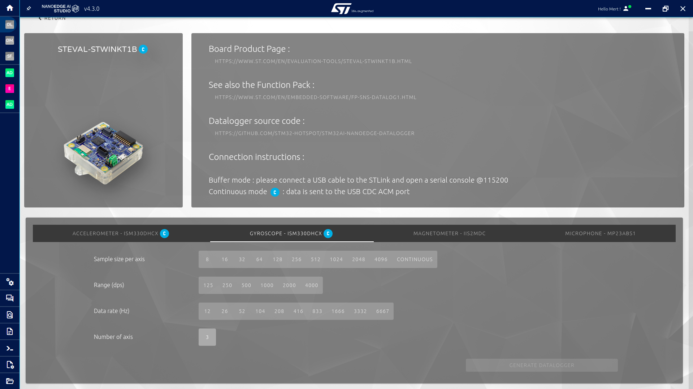

    

## Uygulama: NanoEdge AI Studio ile El Karakterleri Sınıflandırma Uygulaması Geliştirme Adımları

**Bu sayfada, NanoEdge AI Studio ile bir uçta yapay zeka modeli geliştirmenin tüm adımlarını inceleyeceğiz.**

### 1. Ön İşleme Süreçleri

NanoEdge AI Studio, esas olarak **sensör** uygulamaları için geliştirilmiştir. Sensör uygulamaları, genellikle **zaman serisi** verilerinden faydalanılarak oluşturulmaktadır. Uygulamalarda kullanılacak yapay zeka modellerinin doğru bir şekilde oluşturulabilmesi için kullanıcıların uygun veri girişini oluşturmaları gerekmektedir.

Uygun veri girişi, toplanan verinin hedef uygulamanın özelliklerine uygun şekilde bir örnekleme sıklığı (_sampling rate_)  ve veri örneği adedi (_sampling size_) seçilerek gruplanması anlamına gelmektedir. 

**İnsan Aktivitesi Tanıma** uygulaması için, yapılacak el hareketlerinin 1 saniye içinde gerçekleştiği varsayılmış ve modele girdi olarak verilecek bir satırlık verinin sensörlerle toplanılmasında da bu süre dikkate alınarak:
- Her bir ölçüm arasına 8 ms gecikme eklenmiştir.
- 128 adet ölçüm gruplandığında, modele verilecek her örneğin 128 * 8 = 1024 ms'lik (yaklaşık 1 saniye) bir zaman aralığını kapsayacağı öngörülmüştür. 

#### 1.1. **Data Logger (DL)**

- Veri kaydedici (_data logger_), USB portundan veri almak için **aşağıdaki yapılandırma seçenekleri** ile **veri toplamak için kullanıma hazır** bir .bin dosyası çıktısı verir.

- Listelenen kombinasyonlar ile veri toplamak için elde edilen .bin dosyası veri kaydedici olarak seçilen karta doğrudan gömülebilmektedir. (Bu görev için *STM32CubeProgrammer* kullanılabilmektedir):
    - Uyumlu **MCU listesi**,
    - Seçili MCU **sensörleri**,
    - Seçili MCU'ya özgü **parametreler** (her eksen için sample boyutu, sample hızı, veri aralığı, eksen sayısı, vb.).

#### 1.2. **Data Manipulation (DM)**

- Verilen veri setleri üzerinde seçili işlemleri uyguladıktan sonra veri dosyaları çıktısı verir.
    - Satırları **sil**,
    - Sütunları **sil**,
    - Sütun numaralarını değiştir (örn. **sampling**),
    - Satırları **karıştır**.

#### 1.3. **Sampling Finder (SF)**

- Sampling Finder, **Aralıksız toplanan veriler** için en yüksek skoru korumayı amaçlar. Kullanıcıların optimal örnekleme sıklığı (_sampling rate_)  ve veri örneği adedini (_sampling size_) belirlemeleri için farklı kombinasyon örneklerini karşılaştırarak sunar.
- **Girdiler:**
    - Sınıflandırma dosyaları,
    - Kullanılan eksen sayısı,
    - Kullanılan örnekleme frekansı,
    - Test edilecek minimum frekans.

### 2. Modeller

#### 2.1. **Anomaly Detection (AD)**

- Verilerde **anormallikleri tespit eder**,
- **Dinamik model** kullanır.
- **Dinamik modeller**, farklı kartlarda veya farklı koşullarda çalışmak için **uyum sağlama** yeteneği sunar. Bu, modelin kendini **uyarlamak** için **uçta tekrar eğitilme** yeteneğini getirir.
- NEAIS, **hedef MCU veya ISPU'da doğrudan öğrenen eğitimsiz bir model** çıktısı verir.

#### 2.2. **1-Class Classification (1CC)**

- Verilerde **anormallikleri tespit eder**,
- **Statik** model kullanır.
- NEAIS, hedef MCU'da **yalnızca sonuç veren önceden eğitilmiş** aykırı değer tespit modeli çıktısı verir.

#### 2.3. **n-Class Classification (nCC)**

- *n* farklı durumu **sınıflandırır**,
- **Statik** bir model kullanır,
- NEAIS, hedef MCU'da **yalnızca sonuç veren ve önceden eğitilmiş** sınıflandırma modeli çıktısı verir.

#### 2.4. **Extrapolation (E)**

- Önceki uygulamaların aksine, bilinmeyen bir **hedef değeri** tahmin eder (diğer tüm uygulamalar **ayrık değerli** sınıf çıktısı verir),
- **Statik** bir model kullanır,
- Veri setinde uygun şekilde etiketlenmiş verileri girdi olarak alır, USB girdilerini **kabul etmez**,
- NEAIS, hedef MCU'da **yalnızca sonuç veren ve önceden eğitilmiş** bir regresyon modeli çıktısı verir.

### 3. Uçtan Uca Geliştirme Adımları

Seçilen uygulamada **5 adet hareket verisi sınıflandırılmak** ve **modelden bu sınıfları isim isim tahmin etmesi beklenmektedir**. Bu isteğe uygun olarak **n-Class Classification** seçilmiştir.

NanoEdge AI Studio, sürecin hemen her kısmı için kullanıcılara **ipuçları** verir. İpuçlarını uygulayarak, kullanıcılar çıktı performansını önemli ölçüde artırabilir.

#### 3.1. Proje Ayarları:

- Uygulamada kullanıcılara sunulan kartlar STM32U5 serisi MCU'ya sahiptir. Çıktı alınacak yapay zeka modeli bu kartlara gömüleceği için **Your Target** kısmından uygun MCU serisi seçilmelidir. 
- Her ölçüm 6 eksen olarak okunmaktadır, iki farklı sensör kullanıldığı için **Sensor Type** seçeneği Generic, **Number of Axes** ise 6 (her bir sensör için 3 eksen) seçilmelidir.
- Maksimum model RAM ve Flash kullanımı isteğe göre sınırlandırılabilir.

- **Sensor Type (Sensör Türü)**
    - Akım, 1 Eksen
    - Mikrofon, 1 Eksen
    - İvmeölçer, 1-2-3 Eksen
    - Hall Sensörü, 1-2-3 Eksen
    - Generic:
        - Sensör türü yukarıdaki listede yoksa veya birden fazla sensör kullanılıyorsa, kullanıcılar **generic** seçeneğini seçmelidir.
    - Multisensor:
        - **Sadece anomali tespit projelerinde**, Multisensor seçeneği, tipik olarak zaman içinde yavaşça değişen makine durumlarını izlemek için kullanılır. Bu durumlar, **farklı sensör kaynaklarından** gelen değişkenlerle ve/veya sinyal bufferlarının yapay, üst düzey özelliklere dönüştürülmesiyle elde edilebilir.
- **Number of Axes / Variables (Eksen / Değişken Sayısı)**
    - **ÖNEMLİ:** NEAIS, sütun sayısını eksen sayısına bölerek veride kullanılan örnek sayısını kontrol eder. (Örneğin, veri toplamak için 3 eksen ivmeölçer ve 3 eksen jiroskop kullanılıyor ise ve veri 128 adet okumayı gruplayarak örneklendirildiyse, bir satır veri 128 örnek * 6 eksen = 768 sütundan oluşur.)
    - Bu seçenek, Sensör Türü Generic veya Multisensor olarak seçilmediyse pasif gözükecektir.
- Modelin (kütüphanenin) **maksimum RAM** & **maksimum Flash** değerleri.
    

#### 3.2. Sinyaller:

- **From File** - **Dosya ile**
    - Her sınıf için farklı veri dosyaları seçilir.
    
    
    
    - Dosyaları seçtikten sonra veri setleri görülebilir. Eğer **veri uygun değilse**, NanoEdge AI Studio uygun olmayan kısımları vurgular ve kullanıcıdan sorunları düzeltmesini ister.

- **Seri Port (USB) Üzerinden:**
    - Veriler doğrudan USB'den alınır.

**Veriyi içe aktardıktan sonra:**

- Eksenler, verinin sütunlarıdır (features).
- Veri uygunsa, NanoEdge AI Studio verilere **Fourier Dönüşümü** uygularak Frekans Domain'indeki karakteristiklerini görülebilir hale getirir.

- Kullanıcı giriş sinyallerinden **istenmeyen frekans** bileşenlerini **filtrelemek** istiyorsa, **Filtre**yi açabilir. Sinyalleri belirli bir frekans penceresine sınırlandırmak için kesilecek frekansları seçebilir.

#### 3.3. Benchmark (Model Eğitimi ve Performansı)

Bu bölümde, eğitimde kullanılacak **sinyaller (sınıflar)** ve **CPU çekirdek sayısı** seçenekleri işaretlenerek  benchmark başlatılabilir.

Bu pencerede, seçilecek **her veri, ayrı bir sınıf olarak kabul edilir!**

Başlat düğmesine tıkladıktan birkaç saniye sonra benchmark başlayacaktır.

Benchmark ekranında kullanıcı şunları görür:
- Benchmark'ın **durumu**,
- Benchmark'ın **ilerleyişi** ve zaman etiketleri,
- **Performans** göstergeleri,
- **Log** penceresi (Benchmark durumu, çekirdek başına arama hızı, bulunan yeni kütüphaneler, vb.),
- Zaman içinde **performanstaki gelişim**,
- **Duraklat** ve **Durdur** düğmeleri.

Benchmark'tan sonra, kullanıcılar eğitilen tüm kütüphanelerden birini **seçme** seçeneğine sahiptir. Bunun amacı, farklı performans öncelikleri olan kullanıcıların isteklerine uygun modelleri seçmelerini sağlamaktır.

#### 3.4. Validation - Doğrulama

Kullanıcılar test verilerini kullanarak modelleri **karşılaştırabilir** ve **tercih edilen farklı bir modeli seçebilir**.

#### 3.5. Emulator

Modeli **doğrudan NanoEdge AI Studio içinde emüle etmeyi** sağlar.

#### 3.6. Deployment - Model Kütüphanesi Elde Etme

- Kullanıcılar, **eğitilmiş model kütüphanesini** ve C kodu örneklerini **Compile Library (kütüphaneyi derle)** düğmesi ile bilgisayarlarına kaydedebilirler.
- Ekranın sağında bulunan kod örneği, modeli hedef MCU veya ISPU'da kullanmak için bir başlangıç kılavuzu görevi görür.

