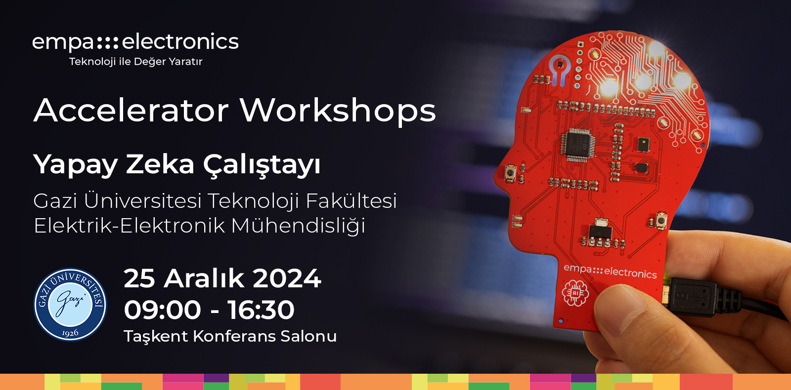

<p align="center">
    
</p>


## Accelerator Workshops'a Hoşgeldiniz!

**Merhaba!**

Empa Elektronik tarafından düzenlenen Accelerators Workshops serimizin "Gazi Üniversitesi Uçta Yapay Zeka Çalıştayı" adımına hoşgeldiniz. Bu açık-kaynak repository, workshop etkiliğimizde kullanabileceğiniz tüm gereksinimleri edinebilmeniz ve aktivitelere kolaylıkla eşlik edebilmeniz için sizinle paylaşılmıştır.

**Sensörler & Connectivity**  
Tanım

**Uçta Yapay Zeka**  
Bir uygulama için geliştirilen yapay zeka çözümlerinin işletilmesi modern sistemlerde iki farklı türde yapılabilmektedir. Bunlardan biri olan bulutta yapay zeka, bir yapay zeka modelinin bulut sunucu üzerinde tesisi (örneğin: AWS/Azure gibi platformlar) ve bu modele gönderilen veri örnekleri için modelden alınan tahminlerin tekrar göndericiye iletilmesi usulüyle çalışmaktadır. Bir diğer alternatif olan uçta yapay zeka, bir modelin doğrudan çözüm için kullanılan bir uç birimde (_edge_, örneğin: sensör kartı) tesis edilmesi ve girdi veriler için elde edilen tahminlerin doğrudan aynı platform üzerinde el edilebilmesidir. Uçta yapay zeka çözümleri, verinin tahminleme için başka bir platforma gönderilmemesi sebebiyle başta düşük gecikme, düşük bant genişliği, düşük güç tüketimi ve veri gizliliği gibi pek çok getiri sağlamaktadır.

## Canlı Demo - Gazi Üniversitesi Teknik Semineri (25 Aralık)
Uçta Yapay Zeka workshop etkinliğimizde gerçekleştirilecek aktivitelerde kullanılacak çalışma ortamları ve gerekli kurulumlar için sırasıyla her bir aktivite için oluşturulan kurulum kılavuzlarına giderek gerekli adımları uygulayınız.

### ↳ [1) Vitis-AI ile FPGA Platformlarında AI Uygulamaları Geliştirme](Demo1_AI_Solution_Development_with_VitisAI)
Yapay zeka çözümlerinin FPGA tabanlı AMD platformlarında kullanımının uygulamalı anlatımını içerir. Bu aktivite, interaktif olarak yapılmayacak olup yalnızca konuşmacıların uygulamalı anlatımı içerir. Aktivite kaynağı olarak sağlanan içerikler, etkinlik sonrası deneyimleme amaçlıdır.

## Çalıştay Aktiviteleri - Gazi Üniversitesi Uçta Yapay Zeka Çalıştayı (25 Aralık)
Uçta Yapay Zeka workshop etkinliğimizde gerçekleştirilecek aktivitelerde kullanılacak çalışma ortamları ve gerekli kurulumlar için sırasıyla her bir aktivite için oluşturulan kurulum kılavuzlarına giderek gerekli adımları uygulayınız. 

### ↳ [1) <MQTT Uygulama Adı>](Activity1_Sensor_Connectivity_with_MQTT)
<MQTT ve sensor uygulaması tanım paragrafı>   
Bu aktivite, kullanıcıların katılımıyla interaktif olarak gerçekleştirilecektir.

### ↳ [2) NanoEdge AI Studio ile Uçta Yapay Zeka Çözümleri Geliştirme](Activity2_NEAIS_for_EdgeAI_Solutions_and_Deployment)
Tiny-ML uygulamaları geliştirmede güçlü bir alternatif oluşturan NanoEdge AI Studio ile uçta yapay zeka uygulamaları geliştirme adımlarını içerir. Bu aktivite, kullanıcıların katılımıyla interaktif olarak gerçekleştirilecektir.

## Dizin Yapısı

Repository içerisindeki her bir klasör, etkinliğimizde yer alacak uygulamalara ait çalışma ortamlarını ve gerekli kurulumları içermektedir.

```
Workshop Repository
├── Activity1_Sensor_Connectivity_and_MQTT
│   ├── Kaynak Kod & Materyaller
│   └── README.md (Aktivite-1 Kılavuzu)
│ 
├── Activity2_NEAIS_for_EdgeAI_Solutions_and_Deployment
│   ├── Kaynak Kod & Materyaller
│   └── README.md (Aktivite-2 Kılavuzu)
│ 
└── Demo1_AI_Solution_Development_with_VitisAI
    ├── Kaynak Kod & Materyaller
    └── README.md (Kılavuz) 
```

## Ön Gereksinimler - Checklist
Etkiliğinde kullanılacak çalışma ortamlarının kurulumları sonrası hazırladığımız checklist ile gereksinimlerin kontrolünü sağlayabilirsiniz.

**Canlı Demo (Teknik Seminer, Kurulum Gerekli Değildir)**
- [ ] Python3.8
- [ ] Docker
- [ ] Vitis-AI Docker Container Ortamı
- [ ] Demo-1 Kaynak Dosyaları

**Aktivite-1 (Uçta Yapay Zeka Çalıştayı)** 
- [ ] MQTT & Sensör Gereksinimleri
- [ ] Aktivite-1 Kaynak Dosyaları

**Aktivite-2 (Uçta Yapay Zeka Çalıştayı)**
- [ ] NanoEdge AI Studio
- [ ] Aktivite-2 Kaynak Dosyaları

## Güncellemeler
Workshop etkinliğimizde gerekli çalışma ortamları üzerindeki güncellemeleri bu başlık altında takip edebilirsiniz.
```
Versiyon-1: 18 Aralık 2024  
Tüm aktiviteler için temel bileşenleri içeren kılavuzlar repository içerisinde paylaşıldı.
```
> _Not: Aktivite çalışma ortamlarının kurulumlarıyla ilgili soru ve taleplerinizi **ai@empa.com** adresine iletebilirsiniz._

> *Not: Workshop aktiviteleri için sağlanan çalışma ortamlarının son hallerini edinmek için Güncellemeler başlığını kontrol ediniz. Kurulumlarını bitirmiş olduğunuz çalışma ortamınıza mevcut güncellemeleri eklemek için terminalinizde AI_Workshop_GU klasörünü açınız ve "git pull" komutu ile güncellemeleri ekleyiniz:*
```
cd Workshop_Workspace/AI_Workshop
git pull origin master
```
